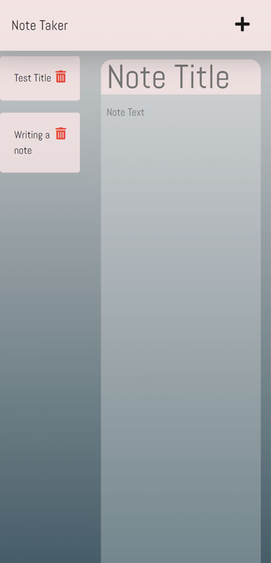
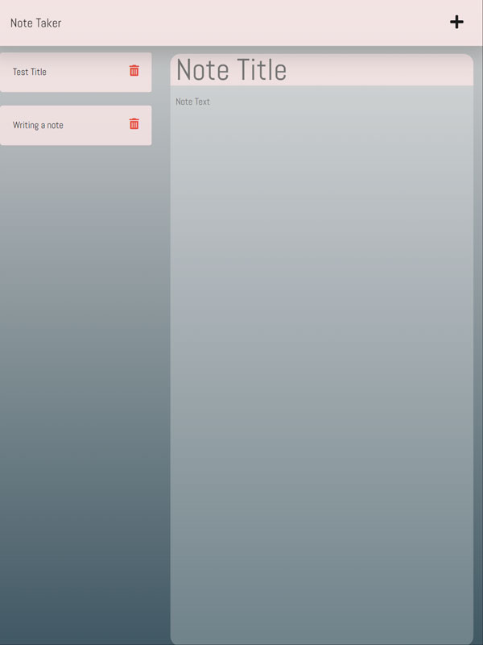
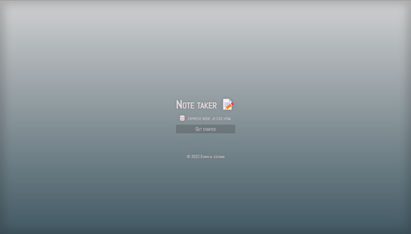

# note-taker

## Description
[Repo](https://github.com/escowin/note-taker) |
 [Live URL](https://note-taker-wbu7.onrender.com/)

`note-taker` is a light weight note-taking app built around Express routing to perform `CRUD` operations.  As an experienced developer in full-stack applications with `ORM` and `ODM` libraries, I decided to revisit this simple `Express` app as a personal challenge. My goal was to reinforce my understanding of refactoring, `JavaScript` methods, `CRUD` operations, and modularization, all while intentionally avoiding the use of a database to handle information.

Initially, I focused on code refactoring when writing custom helper functions. In my pursuit of generating eight-character random ID values, I realized the need for iterative logic. However, I soon noticed repetitive code patterns emerging. To eliminate duplication, I employed `for` loops and `.forEach()` methods, optimizing both the legibility and functionality of the helper functions. This drive to streamline the codebase then spilled over into a comprehensive structural overhaul.

By modularizing the route and controller functions, I transformed the app's components into easily navigable, comprehensible, and extensible elements. Without the use of an `ODM`/`ORM` or any form of database, I was forced to really consider the logic underlying `CRUD` operations. This led me to become more proficient in utilizing various `JavaScript` array methods to manipulate array variables for file read and write operations.

The result is a streamlined note-taking app that has more functionality while at the same time being far less redundant than what it once was.

## Table of Contents
- [Installation](#installation)
- [Usage](#usage)
- [Features](#features)
- [Usage](#usage)
- [Credits](#credits)
- [Author](#author)

## Installation
Run the following command to install necessary dependencies:
```
$ npm i
```

## Test
Run the following command to run tests:
```
npm run test
```

## Usage
Run the following command to run the app:
```
npm start
```







## Features
- Create new notes: Users can create new notes from the `browser` or through `API` requests.
- View notes: Users have the ability to view existing notes, providing quick access to previously saved information.
- Update notes: The app allows users to update their notes, enabling them to make changes or add additional details as needed.
- Delete notes: Users can easily delete unwanted or outdated notes, keeping their note collection organized and clutter-free.
- API integration: The app supports `API` requests, enabling seamless integration with other applications such as `Insomnia`.

## Credits
- Languages: `HTML`, `CSS`, `Javascript`
- Frameworks: `Node`, `Express`

## Author
### Edwin Escobar
- [Email](mailto:edwin@escowinart.com)
- [GitHub](https://github.com/escowin)
